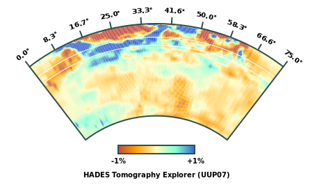

# HADES - Heterogeneous Anomalies in Deep Earth Structures 

  

Source code for the HADES Alpha 0.2.0 tomographic explorer based on various tomographic models. The HADES server and client (www) are provided. The database files that contain the tomographic models are **not** included in this repository. A demo of this application can be found on the [Atlas of the Underworld](http://www.atlas-of-the-underworld.org/hades-underworld-explorer/).

# Models

* UUP07
* MITP08
* SP12RTS-S
* SP12RTS-P

# Reading Models

Models must be put in the `./db` directory. Each model is a JSON object; the delta (δ) array is indexed by `longitude, latitude, depth` in that order. Grid values run from low to high. Please contact me if you need the prepared model files.

    {
      "longitudes": [-180...180],
      "latitudes": [-90...90],
      "depths": [0...2500],
      "model": "model-name",
      "delta": [δ0 ... δN]
    }

# API

HADES is interfaced by a public HTTP API that can be used directly. The server must be queried with the following **required** parameters:

* `phi1` - Latitude of first marker
* `phi2` - Latitude of second marker
* `lam1` - Longitude of first maker
* `lam2` - Longitude of second marker
* `model` - Model identifier (e.g. UUP07)

An example query to the server:

    http://136.144.177.195:8080?phi1=10&phi2=20&lam1=10&lam2=20&model=UUP07

The response is a JSON object with the cross section information.
